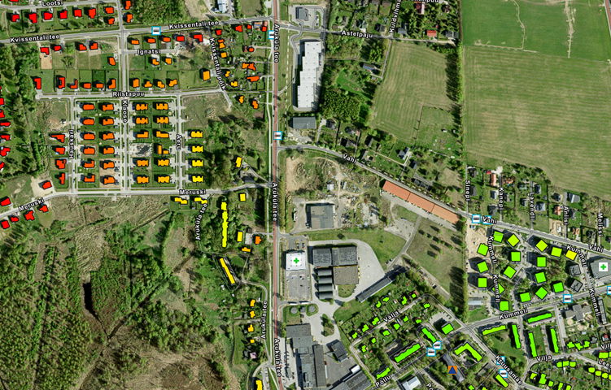
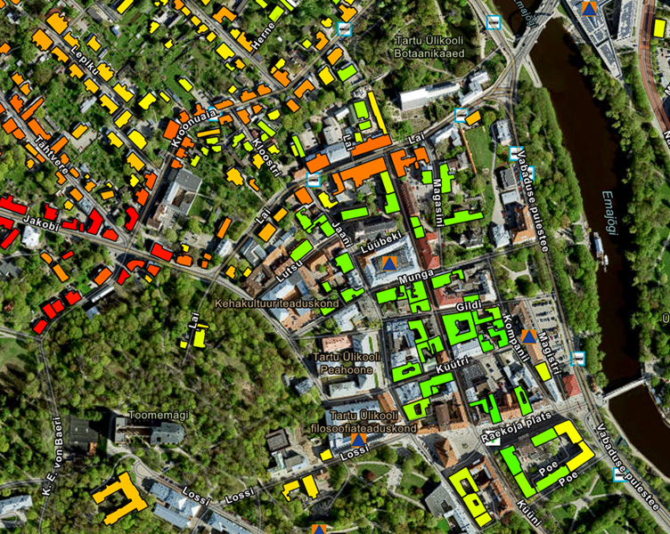

# Introduction

The purpose of this map is to provide useful insights for people intending to buy a new home. The map accounts for multiple environmental and accessibility factors (distances to selected objects and noise pollution) and ranks residential buildings by **Undesirability**.

Undesirability is visualized using a color scale ranging from **green (low undesirability / better)** to **red (high undesirability / worse)**. Additional information can be accessed via **hover** and **click** interactions.

The datasets are limited to **Tartu linn, Tartu linn**.

---

# Undesirability

Undesirability is calculated as the sum of distances (in meters) to the nearest object in each category, plus **10 times the nighttime noise pollution level (dB)**.

Only zoom levels **16 and above** are used for calculation to ensure acceptable map performance.

### Formula

```
Undesirability = sum(distances) + (nighttime_noise × 10)
```

### Object Categories

The following object categories are used:

* **Bus stops**
* **Pharmacies**
* **Shelters**

These categories were chosen to represent different spatial distributions:

* **Bus stops** are widely distributed but have uneven density. Their high number requires spatial constraints when calculating distances.
* **Pharmacies** are relatively evenly distributed.
* **Shelters** are rare and unevenly distributed, which necessitates limiting the impact of very large distances on the undesirability score.

---

## Distance Effects

The effect of distances can be clearly observed in *Image 1*.

* The **Kvissentali** district (top left) has few bus stops and no nearby shelters or pharmacies, resulting in higher undesirability.
* Buildings in the **Kruusamäe** district (lower right) have all three object types nearby, resulting in lower undesirability.

<figure>
  
  <figcaption>Image 1. Effects of distances on Undesirability.</figcaption>
</figure>

---

## Noise Pollution Effects

The impact of nighttime noise pollution is shown in *Image 2*.

* Based solely on distances, the **Old Town** appears to be a desirable area.
* However, buildings along **Kroonuaia** and **Lai** streets are shown as less desirable due to higher nighttime noise levels.

<figure>
  
  <figcaption>Image 2. Effects of nighttime noise pollution on Undesirability.</figcaption>
</figure>

---

# Data Overview

### Nighttime Noise Pollution

* Measured in **2022**
* Based on accredited methodologies used by the **Republic of Estonia Health Board**

**Source:**
[https://teenus.maaamet.ee/ows/myrakaart?service=WFS&version=2.0.0&request=GetCapabilities](https://teenus.maaamet.ee/ows/myrakaart?service=WFS&version=2.0.0&request=GetCapabilities)

---

### Point Objects

* Filtered by the `ay` field to include only **Tartu linn, Tartu linn**
* Separated into individual layers by object type

**Source:**
[https://gsavalik.envir.ee/geoserver/huvipunkt/wfs?service=WFS&version=1.0.0&request=GetCapabilities](https://gsavalik.envir.ee/geoserver/huvipunkt/wfs?service=WFS&version=1.0.0&request=GetCapabilities)

---

### Buildings

* Includes buildings with **use and occupancy permits**
* Filtered to include only **Tartu linn, Tartu linn**

**Source:**
[https://gsavalik.envir.ee/geoserver/maaamet/wfs?service=WFS&version=2.0.0&request=GetCapabilities](https://gsavalik.envir.ee/geoserver/maaamet/wfs?service=WFS&version=2.0.0&request=GetCapabilities)

---

All datasets were downloaded and converted to the **EPSG:4326** coordinate reference system for ease of use.

> In a production setup with static datasets, these calculations should be performed server-side. However, this project intentionally simulates the use of live WFS services.

---

# Events

The map includes the following interactive and automatic features:

### On-hover Event

* Displays the building’s street address in a floating tooltip
* The function is throttled to reduce excessive triggering
* Due to hardware limitations, the performance impact could not be reliably verified

### On-click Event

* Displays distances to nearby objects used in the Undesirability calculation
* Queries nearby points and computes the shortest distance
* Updates the side panel with the results

### Automatic Calculation

* Queries all visible buildings for distances to nearby objects
* Adds nighttime noise pollution values
* Generates color-coded building polygons based on Undesirability
* This process is computationally intensive and runs entirely on the client side

---

# Possible Further Improvements

In addition to graphical enhancements, the following improvements could be implemented:

1. Add more point layers affecting quality of life (e.g. shops, schools).
2. Introduce weighting for different layers or allow users to exclude certain categories.
3. Add polygon layers such as air quality or flood risk maps.
4. Improve performance using the **KDBush** library for spatial indexing.
5. Use **Web Workers** for automatic calculations.
6. Implement caching for repeated calculations.
7. Calculate distances using the **road network** instead of straight-line distance.
8. Highlight the nearest point objects used in the calculations.
